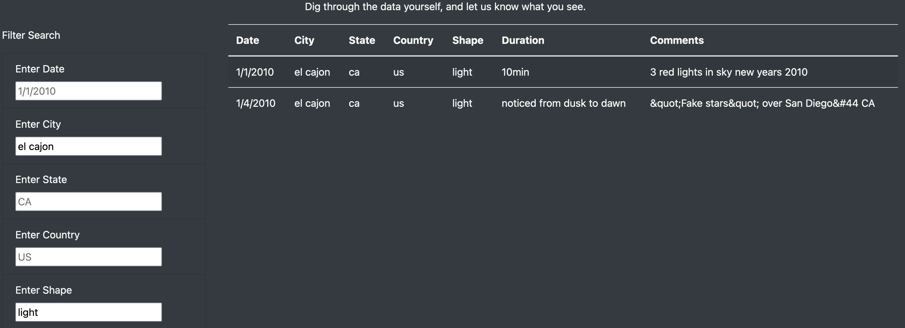

# UFO
## Overview
### UFO Finder
Dana is currently choosing to write about her hometown, McMinnville, Oregon. This town is known for UFO findings and UFO enthusiasts, which has inspired Dana's latest project: designing a webpage to display data detailing UFO findings. After the original functional design of Dana's webpage, we have included multiple filters for users to be able to better narrow down their search of UFO sightings. Dana has accomplished her original purpose of displaying her data on an HTML webpage with filters to display her findings.

## Results
### How to Search
There are four search filters on the webpage: Date, City, State, Country, and Shape. The table will grow and shrink as the different criteria is entered into the filter boxes by the users (i.e. no data matches the criteria, nothing will be displayed in the table).

### Before Search Criteria is Entered

### After Search Criteria is Entered

## Summary
The filter boxes look as though they already have criteria in them when the webpage is initially launched. This is a bit confusing, as you cann't delete the placeholder text, the user just needs to type into the boxes.'

For Further development, it may be cleaner to allow for a "Search" button at the bottom of the filter section instead of just clicking out of the search box to enter. Additionally, the filter boxes can be empty to begin with to avoid any confusion regarding what is already filtered and how to filter as well.
